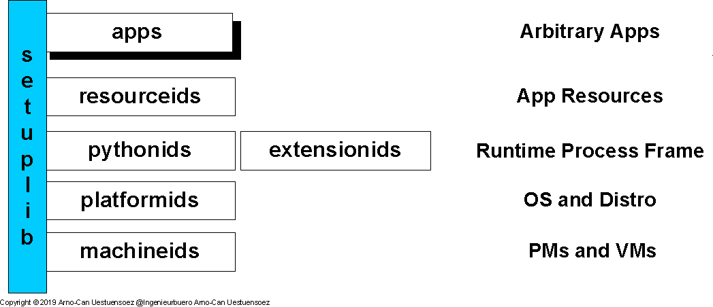

********
Abstract
********

Modern landscapes of information infrastructures are commonly designed 
and organized as stacks of runtime service environments.
The technical architecture of the service stacks consists of a wide range of
heterogenous landscapes of components frequently requiring adaptation and mediation
with extended installations by *setuptools* / *distutils* via *setup.py*.
The variants require in particcular thorough tests in order to fit reliably into
the various target platforms and configurations.

   
   Figure: Installation of Service Layers |figuresystemabstractprint_zoom| :ref:`more... <REFERENCE_ARCHITECTURE>`

.. |figuresystemabstractprint_zoom| image:: _static/zoom.png
   :alt: zoom 
   :target: _static/systems-ids.png
   :width: 16

The *setuptestx* supports the basic interface to call the required regression tests
by a unique intrface on all supported source and target platforms.
This includes for example some of the basic paramteters for *Jython* related to *Java*. 

For tested standard OS and distributions see `installation <install.html>`_ / :ref:`Tested OS and Python Implementations <TESTED_OS_PYTHON>`.
These are supported as the platform for the creation of the Python distributions,
once the distribution package is created, *setuplib* is no longer required.
So for example on the runtime environments for IoT devices such as *MicroPython*.
 
 