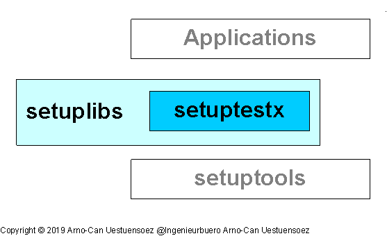

*********
Blueprint
*********

.. _REFERENCE_ARCHITECTURE:

The modern landscapes of information infrastructures are commonly designed 
and organized as stacks of heterogeneous runtime environments
with common frameworks.
These contain frequently various heterogeneous components which has to be tested 
as integrated applications.
The *setuptestx* supports a common call interface for the major implementations 
and releases of Python on various operating systems and their variants of distributions.

.. _FIGURE_ARCHITECTURE:

   
   Figure: Setuplib Integration |setuplibarchitecture_zoom|

.. |setuplibarchitecture_zoom| image:: _static/zoom.png
   :alt: zoom 
   :target: _static/setuplib-architecture.png
   :width: 16

The *setuptestx* is hereby the low-level part, while the more complex test envitonment
is provided by *epyunit* [EPYUNIT]_.

The current provided extensions are:

* Test automation for the unittest of multiple combined source packages:

   .. parsed-literal::
   
      python :ref:`setup.py <SETUPPYSRC>` :ref:`testx <SETUP_TESTX>`             # supports the major implementations:
                                        #    *CPython*, *IPython*, *PyPY* : Python2.7, and Python3.5+ 
                                        #    *IronPython*, *Jython*     : Python2.7
                                        #
                                        # OS see :ref:`Tested Platforms <TESTED_OS_PYTHON>`

Based on mostly defaults it is for example a simple task to use different installed 
*Python* implementations and releases by using the *--implementation* option or the 
short form *-i*:

* *CPython* - see :ref:`HOWTO_CPYTHON`::

      python setup.py testx --print-vinfo -i python
      python setup.py testx --print-vinfo -i python3
      python setup.py testx --print-vinfo -i python3.5
      python setup.py testx --print-vinfo -i python2

* *IPython* - see :ref:`HOWTO_IPYTHON`::

      python setup.py testx --print-vinfo -i ipython
      python setup.py testx --print-vinfo -i ipython2
      python setup.py testx --print-vinfo -i ipython3

* *IronPython* - see :ref:`HOWTO_IRONPYTHON`:

* *Jython*::

      python setup.py testx --print-vinfo -i jython

* *PyPy* - see :ref:`HOWTO_PYPY`::

      python setup.py testx --print-vinfo -i pypy
      python setup.py testx --print-vinfo -i pypy2
      python setup.py testx --print-vinfo -i pypy3

The *setuptestx* supports hereby basic subprocess calls by *os.system()*,
thus supports the modification of the called environment by shell inheritance.
For example in case of the *bash*::

   PATH=/opt/pypy/pypy3.5-5.10.1/bin/:$PATH python setup.py testx --print-vinfo -i pypy

For more advanced options refer to a never release of the *epyunit* [EPYUNIT]_.

